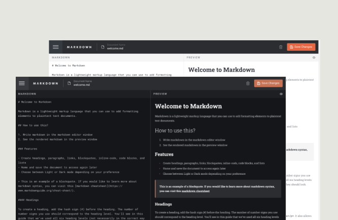

# Markdown Editor



## Description

This is a Markdown editor built with React and TypeScript. It allows users to input Markdown text and see the rendered HTML output in real time.

## Prerequisites

- Node.js v18.0.0 or later
- npm v6.14.0 or later

## Installation

Clone the repository to your local machine:

```bash
git clone git@github.com:evengene/markdown-editor.git
```

Navigate to the project directory:

`cd project-name`

Install the project dependencies:

```bash
npm install
```

## Running the Application Locally

Create an optimized production build of the application:
```bash
next build
```

Start the development mode:
```bash
next dev
```

The application will be available at http://localhost:3000.


## Usage
1. Write your Markdown text in the left-hand text area.
2. The rendered HTML will appear in the right-hand area as you type.


## Features:
- [x] Live Markdown Preview
- [x] Ability to save/ open markdown files
- [x] Edit existing files
- [x] Create new markdown files
- [x] Delete files
- [x] Day/Night mode

## Technologies Used
- React
- TypeScript
- Next.js


## Contributing
Pull requests are welcome. For major changes, please open an issue first to discuss what you would like to change.

## License
[MIT](https://choosealicense.com/licenses/mit/)


